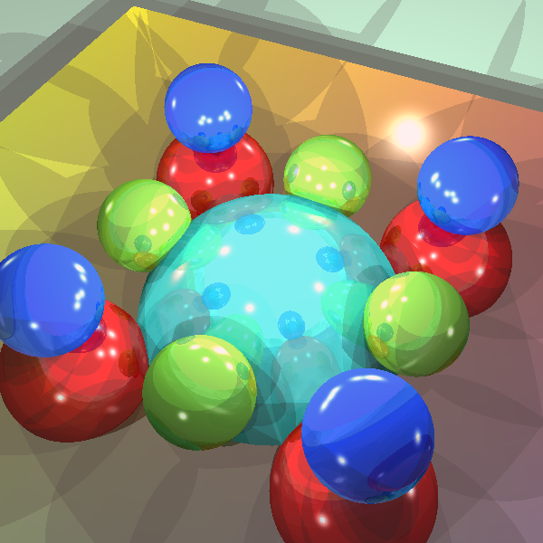

jsRayTrace
==========

implementation of javascript ray trace

* Features
 - Simple implementation of ray trace with HTML5 canvas
 - Multithreading with HTML5 Web Workers (in progress)

* Usage
 - clone current git into your remote HTTP server.
 - remotely run **index.html**.  
   *If you don't need to run with web worker, just run index.html in your local stage.*
